# LINKA — Microservices E-Commerce Platform

  A full-stack e-commerce platform built with <strong>ASP.NET Core 8</strong> and a <strong>microservices architecture</strong>, featuring centralized identity, API Gateway routing, polyglot persistence, real-time communication, cloud image storage, shopping cart, order management, discounts, comments, cargo operations, administration tools, and an integrated shopping assistant.

  
  
  
  
  
  
  
  
  

  <a href="./docs/images/linka-home-assistant.jpg">
    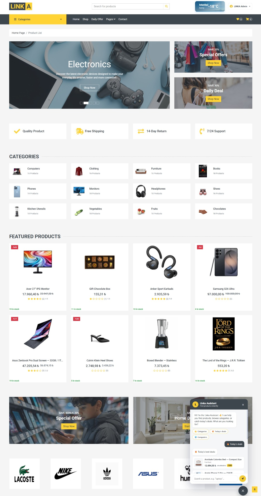
  </a>

  <em>LINKA storefront with dynamic categories, featured products, campaigns, stock information, ratings, and the integrated LINKA Shopping Assistant.</em>

---

## Table of Contents

- [About the Project](#about-the-project)
- [Key Features](#key-features)
- [Architecture](#architecture)
- [Microservices](#microservices)
- [Technology Stack](#technology-stack)
- [Application Preview](#application-preview)

---

## About the Project

**LINKA** is a modular e-commerce application designed around a microservices architecture. Business capabilities are separated into independent services such as Catalog, Basket, Discount, Order, Cargo, Comment, Message, Images, Payment, and Identity rather than being maintained inside a single monolithic application.

The platform combines **Ocelot API Gateway**, **IdentityServer**, **JWT authentication**, **MongoDB**, **Redis**, **SQL Server**, **PostgreSQL**, **Dapper**, **Entity Framework Core**, **RabbitMQ**, **SignalR**, **Google Cloud Storage**, and external API integrations. The Order service additionally applies **Onion Architecture, CQRS, MediatR, and Repository Pattern**.

---

## Key Features

### Customer Experience

- User registration and login with centralized authentication
- Product/category browsing, searching, filtering, and pagination
- Product details, images, ratings, reviews, and stock information
- Featured products, discounts, campaigns, and coupon support
- Redis-backed shopping basket with quantity management
- Checkout and simulated card payment flow
- Automatic stock reduction after successful checkout
- Unique order number generation and order history
- Cargo/customer information and order status tracking
- User profile and wishlist areas
- Product-based buyer-to-buyer messaging
- Integrated shopping assistant for products, categories, and deals
- Weather information through RapidAPI

### Administration

- Admin dashboard with catalog and operational statistics
- Category, product, product detail, image, and brand management
- Slider, feature, special offer, discount, and coupon management
- Comment, user, and role management
- Order management and order status updates
- Cargo company management
- Search, filtering, pagination, and featured-product controls

### Platform / Backend

- Independent REST APIs with Swagger/OpenAPI support
- Ocelot API Gateway and protected service routing
- IdentityServer-based authentication and authorization
- JWT Bearer validation and scope-based permissions
- Polyglot persistence across MongoDB, Redis, SQL Server, and PostgreSQL
- Dapper and Entity Framework Core data-access approaches
- SignalR real-time communication infrastructure
- RabbitMQ producer/consumer messaging
- Google Cloud Storage upload, delete, and signed URL operations
- AJAX / Fetch-based asynchronous UI operations

---

## Architecture

LINKA uses an API Gateway-centered microservices architecture. The ASP.NET Core MVC client communicates with backend services through **Ocelot**, while **IdentityServer** handles authentication and token generation. Each microservice owns a specific responsibility and uses the storage technology appropriate for its workload.

  <a href="./docs/images/linka-microservice-diagram.png">
    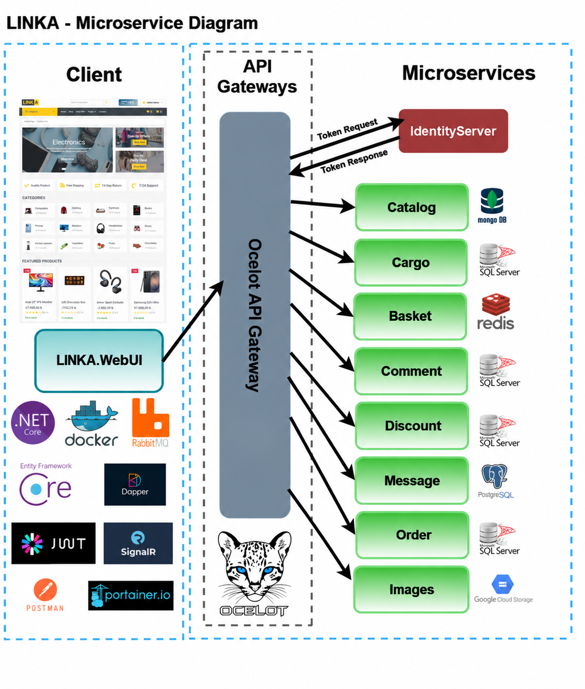
  </a>

  <em>LINKA microservice architecture showing the WebUI client, Ocelot API Gateway, IdentityServer, independent services, and their respective data stores.</em>

---

## Microservices

| Service / Project | Responsibility | Main Technology / Storage |
|---|---|---|
| **Linka.Catalog** | Products, categories, brands, product details/images, features, offers, sliders, content, and catalog statistics | MongoDB, AutoMapper |
| **Linka.Basket** | User shopping basket operations | Redis |
| **Linka.Discount** | Discount coupons and discount statistics | Dapper, SQL Server |
| **Linka.Order** | Order addresses/details, creation, status, and queries | Onion Architecture, CQRS, MediatR, Repository Pattern, EF Core, SQL Server |
| **Linka.Cargo** | Cargo companies, customers, details, and operations | Repository Pattern, EF Core, SQL Server |
| **Linka.Comment** | Product reviews/comments and comment statistics | EF Core, SQL Server |
| **Linka.Message** | Product-based conversations, messages, read state, and message statistics | EF Core, PostgreSQL |
| **Linka.Images** | Cloud image upload, delete, and signed URL generation | Google Cloud Storage |
| **Linka.Payment** | Payment-service boundary; simulated checkout/payment flow | ASP.NET Core Web API |
| **Linka.IdentityServer** | Authentication, users, roles, clients, API resources, and scopes | IdentityServer4, ASP.NET Core Identity, SQL Server |
| **Linka.OcelotGateway** | Central API routing and protected service access | Ocelot, JWT Bearer |
| **Linka.SignalRRealTimeApi** | Real-time hub and live notification/statistics infrastructure | SignalR |
| **Linka.RabbitMQMessageApi** | Queue-based producer/consumer messaging | RabbitMQ |
| **Linka.RapidApiUI** | External API consumption | RapidAPI, HttpClient, Newtonsoft.Json |
| **Linka.WebUI** | Customer/admin MVC application and API consumption layer | ASP.NET Core MVC, Razor, HttpClient, JavaScript |
| **Linka.DtoLayer** | Shared frontend DTO models | .NET 8 |

---

## Technology Stack

### Backend

- C# / .NET 8
- ASP.NET Core MVC & Web API
- Entity Framework Core
- Dapper
- AutoMapper
- MediatR
- IdentityServer4 / ASP.NET Core Identity
- JWT / JWT Bearer Authentication
- Ocelot API Gateway
- SignalR
- RabbitMQ
- Swagger / OpenAPI
- HttpClient / API Consumption

### Databases & Storage

- MongoDB
- Redis
- Microsoft SQL Server
- PostgreSQL
- SQLite package/support in the IdentityServer project
- Google Cloud Storage

### Frontend / UI

- Razor Views
- HTML5 / CSS3
- JavaScript
- AJAX / Fetch API
- Bootstrap-based UI components
- SignalR JavaScript Client

### Development & Integration Tools

- Docker Desktop
- Portainer
- Postman
- RapidAPI
- Git / GitHub

> **Docker usage:** Docker Desktop is used for LINKA's local infrastructure layer, including multiple SQL Server database containers and Redis, with Portainer used for container management. The .NET application services are currently launched from the solution rather than orchestrated as one complete Docker Compose application.

---

## Application Preview

The main storefront is shown at the top of this README. Additional screens from the shopping, messaging, administration, order, and development workflows are available below. Click an image to open the full-resolution version.

<strong>View additional application screenshots</strong>

 

<table>
  <tr>
    <td width="50%" align="center">
      <strong>Product Listing & Filtering</strong>  
      <a href="./docs/images/product-list.jpg">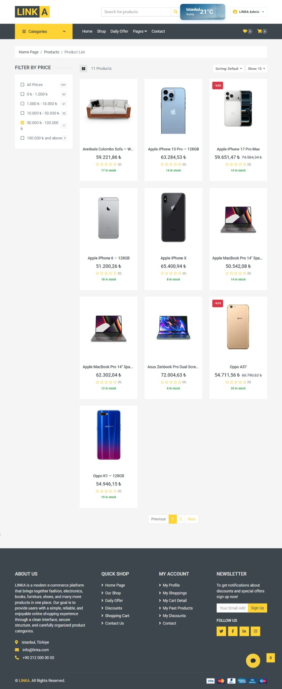</a>
    </td>
    <td width="50%" align="center">
      <strong>Product Details & Reviews</strong>  
      <a href="./docs/images/product-details-reviews.jpg">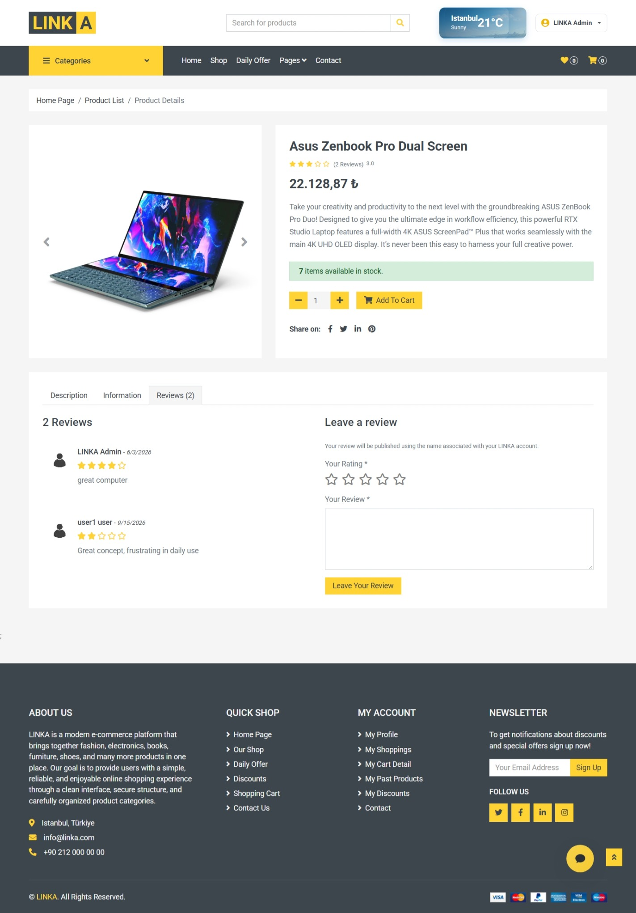</a>
    </td>
  </tr>
  <tr>
    <td width="50%" align="center">
      <strong>Redis-Backed Shopping Cart</strong>  
      <a href="./docs/images/shopping-cart.jpg">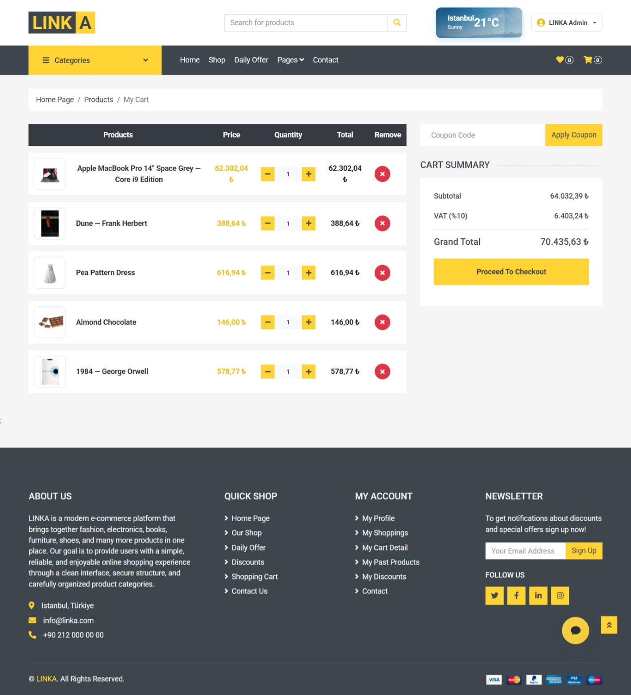</a>
    </td>
    <td width="50%" align="center">
      <strong>Simulated Secure Payment</strong>  
      <a href="./docs/images/secure-payment.jpg">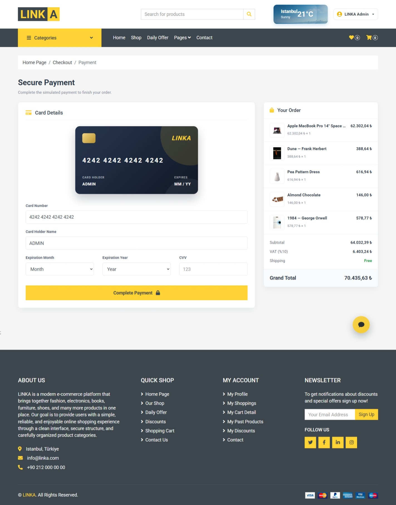</a>
    </td>
  </tr>
  <tr>
    <td width="50%" align="center">
      <strong>Order Completion</strong>  
      <a href="./docs/images/order-completed.jpg">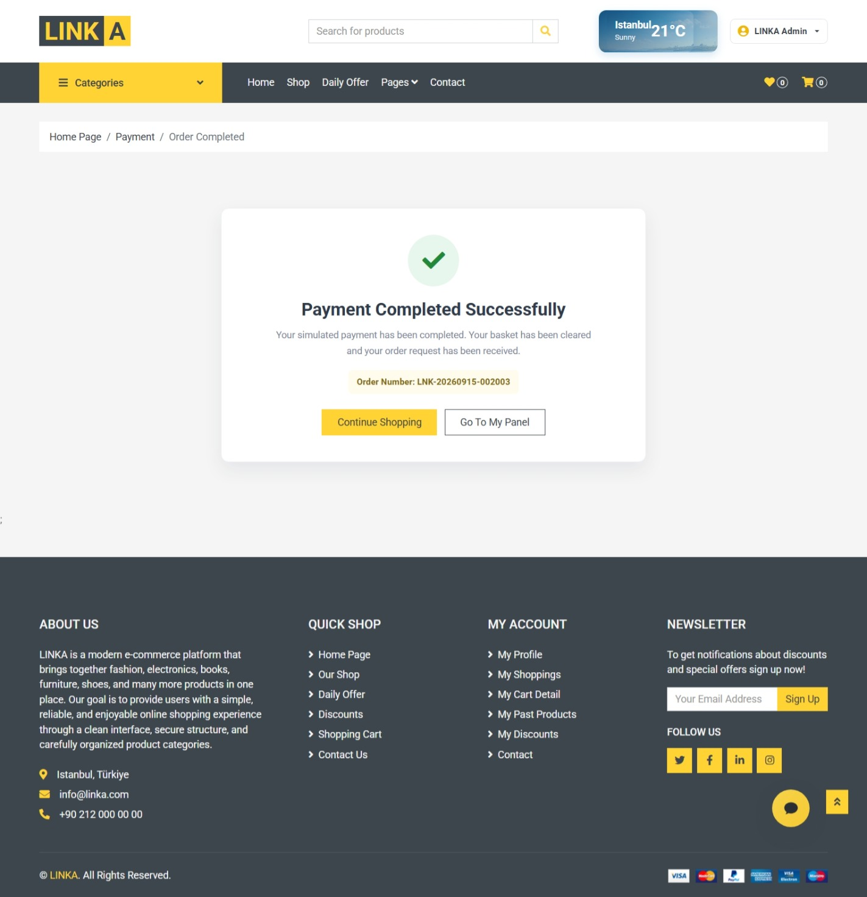</a>
    </td>
    <td width="50%" align="center">
      <strong>User Order Details</strong>  
      <a href="./docs/images/user-order-details.jpg">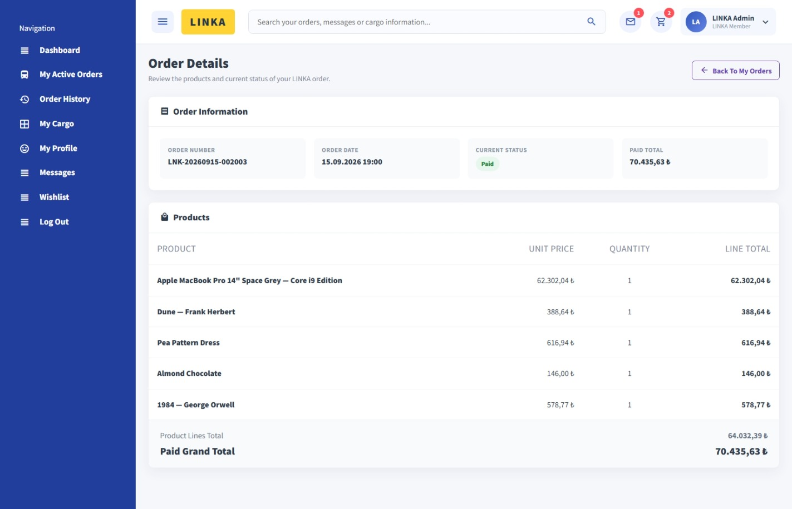</a>
    </td>
  </tr>
  <tr>
    <td width="50%" align="center">
      <strong>Product-Based User Messaging</strong>  
      <a href="./docs/images/user-to-user-messaging.jpg">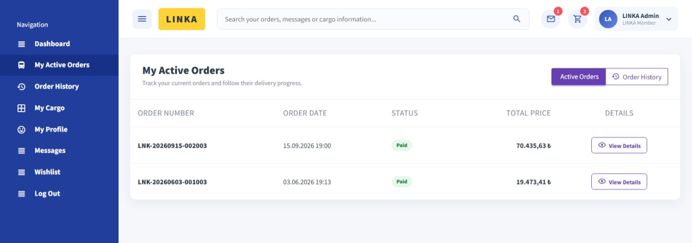</a>
    </td>
    <td width="50%" align="center">
      <strong>Admin Dashboard</strong>  
      <a href="./docs/images/admin-dashboard.jpg">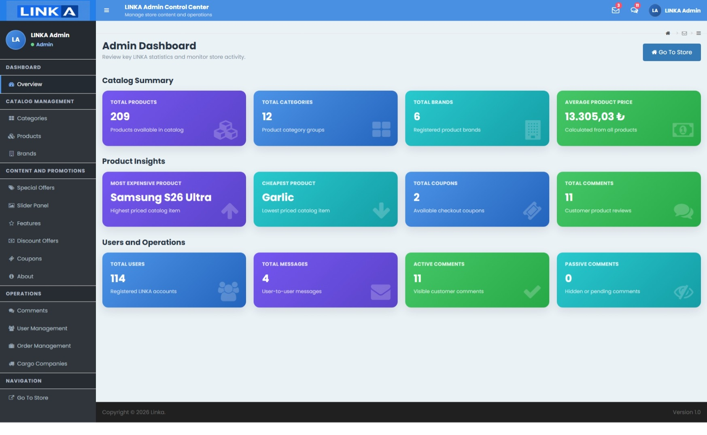</a>
    </td>
  </tr>
  <tr>
    <td colspan="2" align="center">
      <strong>Admin Product Management</strong>  
      <a href="./docs/images/admin-product-management.jpg">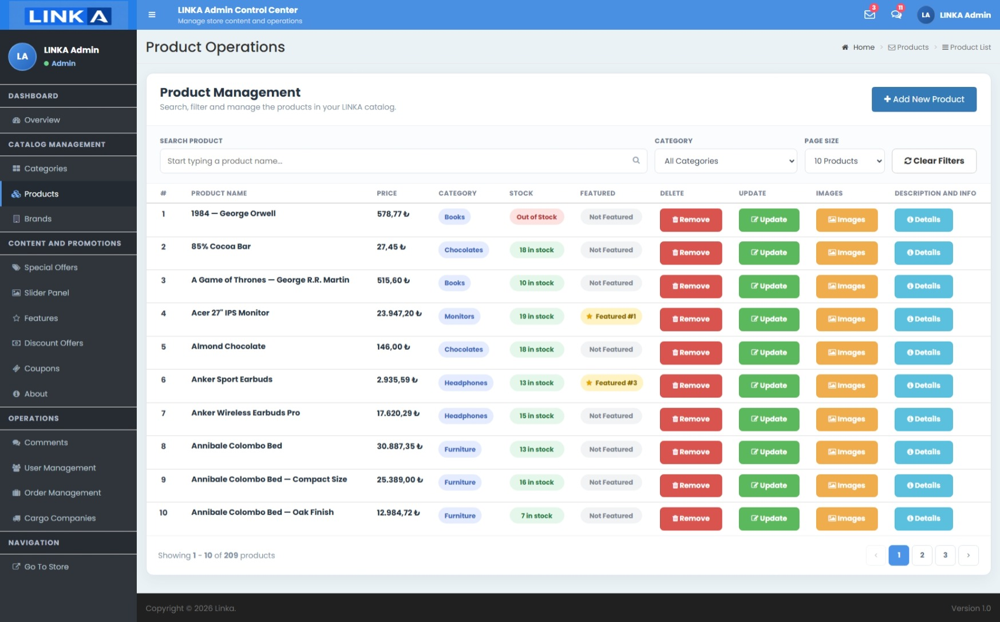</a>
    </td>
  </tr>
  <tr>
    <td colspan="2" align="center">
      <strong>Docker Local Infrastructure</strong>  
      <a href="./docs/images/docker-local-infrastructure.png">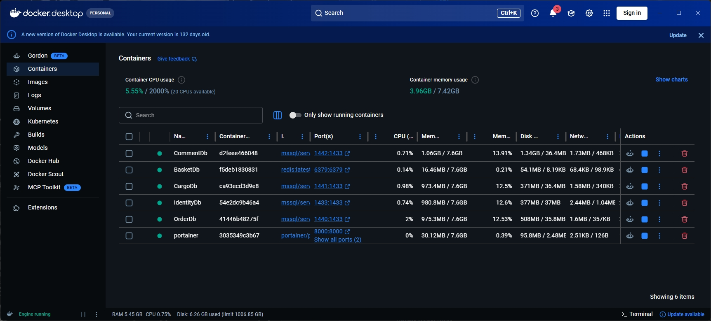</a>
    </td>
  </tr>
</table>

